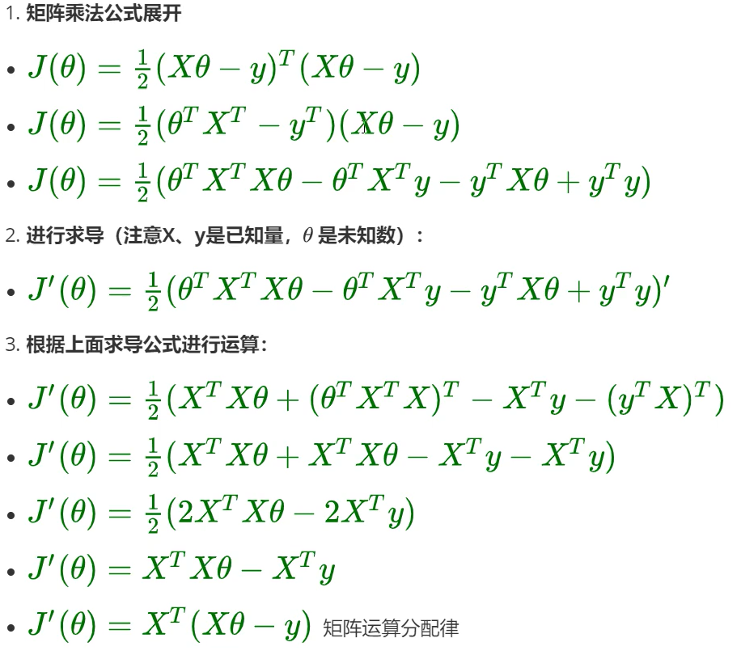
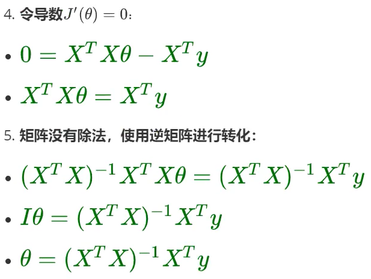
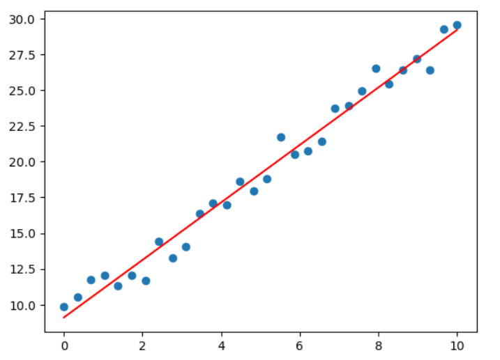
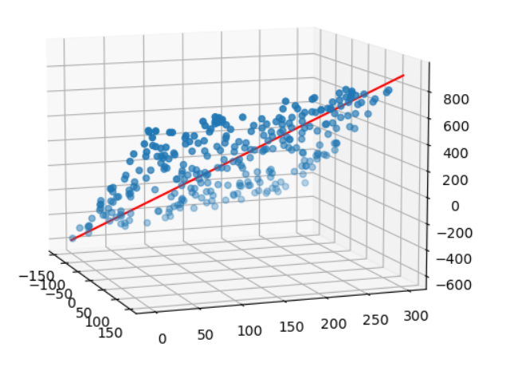

+++
author = "HansonLiao"
title = "LinearRegression"
date = "2024-02-19"
description = "Getting started with linear regression and a brief description"
categories = [
    "machine-learning",
    "LinearRegression",
]
image = "image2.png"

math= "true"

+++


{{ if or .Page.Params.math .Site.Params.math }}
<!-- KaTeX -->
<link rel="stylesheet" href="https://cdn.jsdelivr.net/npm/katex@0.11.1/dist/katex.min.css" integrity="sha384-zB1R0rpPzHqg7Kpt0Aljp8JPLqbXI3bhnPWROx27a9N0Ll6ZP/+DiW/UqRcLbRjq" crossorigin="anonymous">

<script defer src="https://cdn.jsdelivr.net/npm/katex@0.11.1/dist/katex.min.js" integrity="sha384-y23I5Q6l+B6vatafAwxRu/0oK/79VlbSz7Q9aiSZUvyWYIYsd+qj+o24G5ZU2zJz" crossorigin="anonymous"></script>
<script defer src="https://cdn.jsdelivr.net/npm/katex@0.11.1/dist/contrib/auto-render.min.js" integrity="sha384-kWPLUVMOks5AQFrykwIup5lo0m3iMkkHrD0uJ4H5cjeGihAutqP0yW0J6dpFiVkI" crossorigin="anonymous" onload="renderMathInElement(document.body);"></script>

{{ end }}


# Linear Regression

## 1、基本概念

回归：为一个或多个**自变量**与**因变量(需要预测的值)**之间的关系进行*建模*，常用来表示输入和输出之间的关系。

需要预测的值:目标变量，target，y，连续值预测变量

因变量：$\chi_1...\chi_n $，可以是连续也可以是离散值

关系：即要求得的模型

线性回归：**有监督**机器学习下的一种算法

> 有监督指在已经存在的历史数据中寻找规律


### 1.1线性模型

简单线性回归：$y=\omega x+b$ 

> * $\omega$为权重，可以有多个，**决定了每个特征对预测值的影响程度**
> * b为偏置，决定输入特征为0时对应的取值

上述公式是对输入特征的*仿射变换*，特点是通过加权和对特征进行线性变换，再通过偏置项进行平移。

#### 1.1.1最优解

$y$：真实值

$\hat{y}$：预测值

$\varepsilon$：误差

> 最优解即可以找到模型使整体的误差最小，让模型更好的拟合数据，整体的误差称为**损失**,Loss通过损失函数计算得到。

#### 1.1.2多元线性回归

多个特征在影响变量

公式：$\hat{y} =\omega_1x_1+...+\omega_nx_n+b$

向量化：$\hat{y} =\omega^{\top}X+b$

把b视为$\omega _0*1$，则$\omega $列增加一个$\omega _0$，$X$列增加一个1。

这样操作可以把形式统一为$\hat{y} =\omega^{\top}X$，权重和偏置项是要训练出来的参数。


## 2、正规方程

### 2.1解析解

最小二乘法将误差方程转化为有确定解的代数方程组(方程数目等于未知数数目)：
$$
\omega ^{*}=(X^{\top}X)^{-1}X^{\top}y
$$

### 2.2最小二乘法

公式：
$$
J(\theta)=\frac{1}{2}\sum_{i=0}^{n}(h_\theta (x_i)-y_i)^2
$$
变型：
$$
J(\theta)=\frac{1}{2}(X\theta-y)^{\top}(X\theta-y)
$$


### 2.3正规方程解多元一次方程

有一次方程组如下：
$$
\begin{cases}
x + y &= 14 \\
2x - y &= 10
\end{cases}
$$
求解方法(代码)：

```python
X=np.array([[1,1],[2,-1]])
y=np.array([14,10])
np.linalg.solve(X,y)
#linalg代表线性代数，solve表示计算线性回归问题
```

输出：

```python
array([8.,6.])
```

> 说明得到的模型方程为：$f(x,y)=8x+6y$
>
> 其中x,y即方程组未知数前的系数

以上过程等价于解析解的求解过程：

```python
A=X.T.dot(X)
B=np.linalg.inv(A)#求逆矩阵
C=B.dot(X.T)
C.dot(y)
```

等价于：

```python
w=np.linalg.inv(X.T.dot(X)).dot(X.T).dot(y)
```

### 2.4 sklearn

#### 2.4.1导包

```python
from sklearn.linear_model import LinearRegression
```

#### 2.4.2 建立模型导入数据

```python
model=LinearRegression(fit_intercept=Flase)
#将计算截距置为False
model.fit(X,y)
#fit特指模型、算法训练、拟合
model.coef_
#X-数据，y-目标值
#coef_结果，返回值
#coef 系数，斜率即方程的解
model.intercept_ #返回截距
```

当*fit_intercept=Flase*的时候，默认使用正规方程求解，而修改为True后则不是。

#### 2.4.3 处理增加截距后的方程组

* fit_intercept=Flase：

增加截距等同于增加了偏置项*bias*，此时如果想得到一样的方程组的解，需要同1.1.2的做法一样，$X$增加一列1：

```python
np.concatenate([X,np.full(shape=(8,1),fill_value=1)],axis=1)
```

> $np.concatenate([array1,array2],axis=0/1..)$
>
> 将两个数组按规定方向拼接到一起。

当然，增加了偏置项，如果要得到唯一解则需要方程数**大于等于**解的个数。

* fit_intercept=True：

当设置截距存在的情况下，无需为X添加一列1，直接在原先的基础上可以直接求出解和截距。

### 2.5 正规方程推导





## 3、总结

最小二乘法估计前提是假定误差服从正态分布，即样本误差出现是随机的，独立的，使用最大似然估计思想，利用损失函数最小化Loss即可求出最优解。

如果数据误差不相互独立，或者不随机出现，就不符合假设。


## 4、代码演示

### 4.1 正规方程

#### 4.1.1 简单线性回归

```python
import numpy as np
import matplotlib.pyplot as plt
X=np.linspace(0,10,num=30).reshape(-1,1)
#在0，10之间均匀分布生成30个数据
w=np.random.randint(1,5,size=1)
b=np.random.randint(1,10,size=1)
#随机生成w和b
y=X*w+b+np.random.randn(30,1)
#计算对应的y

plt.scatter(X,y)

X=np.concatenate([X,np.full(shape=(30,1),fill_value=1)],axis=1)
#因为存在截距，在X增添一列1
a=np.linalg.inv(X.T.dot(X)).dot(X.T).dot(y).round(2)
#正规方程计算answer
plt.plot(X[:,0],X.dot(a),color='red')
#表示将X矩阵的第一列数据作为x轴数据，X矩阵的每一行数据与向量a点乘的结果作为y轴数据
```

结果如图：



#### 4.1.2 多元线性回归

```python
import numpy as np
import matplotlib.pyplot as plt
from mpl_toolkits.mplot3d.axes3d import Axes3D

X1=np.random.randint(-150,150,size=(300,1))
X2=np.random.randint(0,300,size=(300,1))

w=np.random.randint(1,5,size=2)
b=np.random.randint(1,10,size=1)
#随机生成w和b
y=X1*w[0]+X2*w[1]+b+np.random.randn(300,1)
#计算对应的y

fig=plt.figure(figsize=(9,6))
ax=Axes3D(fig)
ax = fig.add_subplot(111, projection='3d')
#在当前图形中添加一个子图，子图使用3D投影
ax.scatter(X1,X2,y)
#生成三维图像
ax.view_init(elev=10,azim=-20)
#调整视角，elev参数控制观察者的仰角（上下旋角度），azim控制方位角（左右旋角度）

X=np.concatenate([X1,X2,np.full(shape=(300,1),fill_value=1)],axis=1)
#因为存在截距，在X增添一列1
a=np.linalg.inv(X.T.dot(X)).dot(X.T).dot(y).round(2)
#正规方程计算answer
x=np.linspace(-150,150,100)
y=np.linspace(0,300,100)
z=x*a[0]+y*a[1]+a[2]
ax.plot(x,y,z,color='red')
```

结果：




### 4.2 sklearn

#### 4.2.1 简单线性回归

```python
from sklearn.linear_model import LinearRegression
import numpy as np
import matplotlib.pyplot as plt
X=np.linspace(0,10,num=30).reshape(-1,1)
#在0，10之间均匀分布生成30个数据
w=np.random.randint(1,5,size=1)
b=np.random.randint(1,10,size=1)
#随机生成w和b
y=X*w+b+np.random.randn(30,1)
#计算对应的y
plt.scatter(X,y)
model=LinearRegression()
model.fit(X,y)
w_=model.coef_
b_=model.intercept_

plt.plot(X,X.dot(w_)+b_,color='green')
```

#### 4.2.2 多元线性回归

```python
from sklearn.linear_model import LinearRegression
import numpy as np
import matplotlib.pyplot as plt
from mpl_toolkits.mplot3d.axes3d import Axes3D

X1=np.random.randint(-150,150,size=(300,1))
X2=np.random.randint(0,300,size=(300,1))

w=np.random.randint(1,5,size=2)
b=np.random.randint(1,10,size=1)
#随机生成w和b
y=X1*w[0]+X2*w[1]+b+np.random.randn(300,1)
#计算对应的y

fig=plt.figure(figsize=(9,6))
ax=Axes3D(fig)
ax = fig.add_subplot(111, projection='3d')
#在当前图形中添加一个子图，子图使用3D投影
ax.scatter(X1,X2,y)
#生成三维图像
ax.view_init(elev=10,azim=-20)
#调整视角，elev参数控制观察者的仰角（上下旋角度），azim控制方位角（左右旋角度）
X=np.concatenate([X1,X2],axis=1)
model=LinearRegression()
model.fit(X,y)
w_=model.coef_.reshape(-1)
b_=model.intercept_
x=np.linspace(-150,150,100)
y=np.linspace(0,300,100)
z=x*w_[0]+y*w_[1]+b_
ax.plot(x,y,z,color='green')
```

